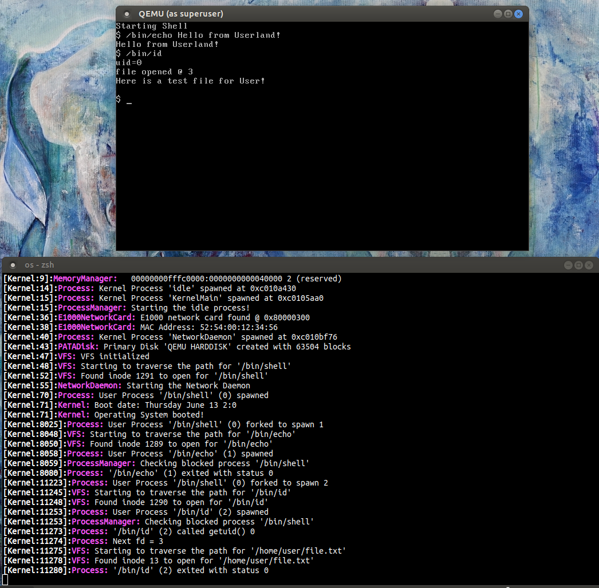

This page is used to track my progress building a 32-bit x86 operating system
completely from scratch. The entire codebase is written by me in C++ and
Assembly, with the only exception being the bootloader. The project serves as a
practical exploration of the many algorithms, mechanisms, protocols, and
standards used to build a fully functioning operating system.

In addition to the operating system, I have also developed a C++ template library
called [Universal](https://github.com/jsnal/os/tree/master/Universal). It
includes essential data structures and algorithms like array lists, smart
pointers, strings, and more.

## Features

* 32-bit kernel with pre-emptive multitasking
* Full-fledged userland with system calls and memory protection
* POSIX compatibility with libc, system calls, shell
* Virtual file system and ext2 file system
* TTY with escape sequences and 16-bit color
* Layer 2 and 3 networking
* Driver support for
  * E1000 network interface card
  * PATA disks
  * PS/2 keyboard
  * Generic PCI devices

## Screenshots

Below is a running list of screenshots

### June 12, 2025

Running a process from userland and reading from a file on the file system

