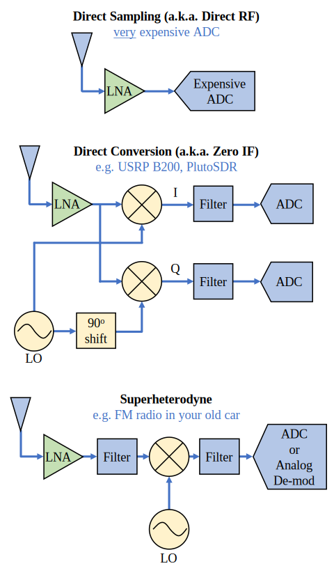
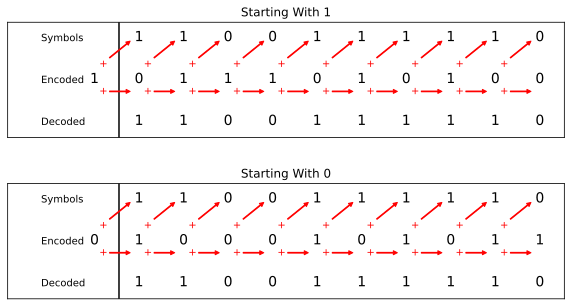
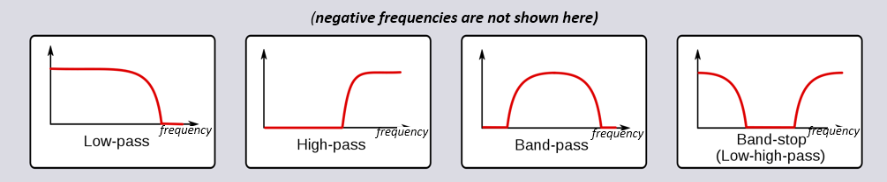

# Introduction

Notes taken while working through various readings on DSP and SDR.

* Digital Signal Processing (DSP): The processing of digital signals in various
  ways. May be used for many signals such as voice, audio, video temperature,
  pressure, etc. The goal of DSP may vary depending on the application.
* Software-Defined Radio (SDR): Software performing signal processing tasks that
  were traditionally performed by hardware, specific to RF/radio application.

Below are the list of resources used to write these notes:

* [PySDR](https://pysdr.org)
* [Fourier Series](https://mathworld.wolfram.com/FourierSeries.html)
  
# Frequency Domain

Time domain represents how a signal changes over time, usually showing its
amplitude at each point in time. Frequency domain represents the signal's
constituent frequencies and their magnitudes. Signals are always sampled in the
time domain because there is no way to directly sample a signal in the frequency
domain.

## Fourier Series

Any signal can be represented by sine waves summed together. When a single
signal is broken down into its composite sine waves, this is called a **Fourier
series**.

{ width=50% }

Some signals will require more sine waves than others, and some may even require
and infinite amount. A signal can always be approximated with a limited number.
This is a list of all the attributes a sine wave may have:

* **Amplitude:** How strong the wave is
* **Frequency:** The number of waves per second. Measured in Hertz.
* **Phase:** How the wave is shifted in time, anywhere from 0 to 360 degrees (or 0
  to 2$\pi$). It must be relative to something to have meaning, such as two
  signals being 30 degrees out of phase with each other.
* **Period:** The amount of time, in seconds, for the wave to finish one cycle. It
  is the inverse of frequency or (1 / Frequency).

## Time-Frequency Pairs

While the time domain show how a signal changes over time, the frequency domain
shows how much of a signal rests in which frequencies. As such, the x-axis will
be frequency instead of time. A signal can easily be plotted and compared in
both domains.

{ width=50% }

A signal with a single oscillating frequency will have a single peak in the
frequency domain. The mathematical name for the peak is called an **impulse**.
An impulse in the time domain is completely flat in the frequency domain and
theoretically contains every frequency. Of course, this is not possible in
nature as an impulse in the time domain would need to be infinitely short. The
takeaway is that quick changes in the time domain result in many frequencies in
the frequency domain.
  
## Fourier Transform

The operation used to go from the time domain to the frequency domain and back
is called a **Fourier transform**. Below are the continuous and discrete
equations.

{ width=50% }

The $j$ is simply the imaginary unit, used instead of $i$ because electrical
engineers use $i$ to denote current in circuit diagrams. The continuous form is
used in mathematics problems, while the discrete form is closer to what is
implemented in code for engineering purposes.
  
## Time-Frequency Properties

There are five properties that tell us what happens in the frequency domain when
a change is made in the time domain.

* **Linearity:** If we add two signals in time, then the frequency domain
  version will also be the two frequency domain signals added together. It also
  tells us that multiplying by a scaling factor will scale both signals by the
  same amount.
* **Frequency shift:** If a time domain signal is multiplied by a sine wave,
  then the frequency domain is shifted by that frequency. This property is used
  in DSP to shift signals up and down in frequency.
* **Scaling in time:** Scaling in the time domain causes inverse scaling in the
  frequency domain, meaning more bandwidth. In other words, when we transmit
  bits faster we have to use more bandwidth.
* **Convolution in time:** When time domain signals are convolved, it's
  equivalent to multiplying the frequency domain versions of those two signals.
  Convolution is essentially creating a new signal from input signals. It is
  used extensively in DSP for filters.
* **Convolution in frequency:** The convolution property also works in reverse
  although it's far less common.

## Fast Fourier Transform (FFT)

Fast Fourier transform is an algorithm used to compute discrete Fourier
transform developed decades ago. An FFT will have one input, a vector of
samples, and one output, a vector of the samples in the frequency domain. The
size of the output is always the same as the size of the input. In addition, the
output will always span the entire x-axis since it's in the frequency domain and
is separate from the time the signal happened or the number of samples. The more
samples in the input vector, the better resolution in the frequency domain. It
may also be faster depending on the implementation.

Sample rate dictates how many frequencies we can detect, not the size of the
input. A higher sample rate increases the bandwidth. The output of an FFT will
always be from $-\frac{f}{2}$ to $\frac{f}{2}$ for $f$ is the sample rate in Hz.

The input may contain complex numbers depending on the situation. If the input
is complex, the negative and positive portions will be different, but if it's
real then they will be identical. In the case of a real input, the signal will
essentially be mirrored across the center frequency.

There is no such thing as a negative frequency when it comes to transmitting
or receiving a RF signal. It is a representation we use that is based on complex
numbers. If an SDR is tuned for 100 MHz with a sample rate of 10 MHz, the SDR
may returns results from -5 MHz to 5 MHz. We would know that it is tuned for 100
Mhz and can map the output to 95 MHz to 105 MHz.

Changing the order things happen in the time domain does not change the
frequency components that exist in the signal. This is because the order in time
does not matter.

## Windowing

An FFT mathematically assumes that the input signal is periodic. It treats the
final sample as if it connects directly back to the first sample, creating an
infinite, repeating loop. When the value of the first sample and the last sample
are significantly different, this will create a sudden transition at the start
and end of the repeating signal. This introduces high-frequency components into
the signals spectrum, called spectral leakage.

The solution is to multiple the signal by a window function that tapers to zero
on both ends. This ensure the signal smoothly starts and ends at zero. Popular
window functions: Hamming, Hanning, Blackman, and Kaiser. Applying no window is
often referred to as using a rectangular window.

## FFT Sizing

The best FFT size is always a power of 2 due to the algorithm used. Other sizes
may be used but the computation will be noticeably slower. The most common sizes
range from 128 to 4096. For signals with millions or billions of samples, the
signals can be broken up into blocks where each one gets an FFT computed.

## Spectrogram

A spectrogram is a plot that shows the frequency over time. It can be thought of
as stacking a bunch of FFTs together vertically. We can also display how the FFT
responds in real-time, which is referred to as a waterfall.

{ width=50% }

# IQ Sampling

IQ sampling is the form of sampling that an SDR performs, as will as many other
digital receivers and transmitters.
  
Sampling is the process of periodically taking the value of a continuous, analog
signal at a specific moment in time. An analog to digital converter (ADC) is
used to sample and covert the analog electrical voltage into a digital number.
The values of the continuous signal are recorded in regular intervals called the
**sample period**. The frequency at which samples are taken, number per second,
is the **sample rate** measured in Hz. The sample rate is the inverse of the
sample period.

## Nyquist Sampling

We must sample at twice the frequency of the signal in order to remove false
data, referred to as the Nyquist frequency. This is simple when the signal is a
simple sine wave, but most signals will have many frequency components to them.
In these cases, the sample rate must be twice the maximum frequency component.
The minimum rate at which we can sample and still retain all information in the
signal is known as the Nyquist rate.

Many SDRs filter out everything above the $\frac{f}{2}$ right before the sampling is
performed to reduce aliasing. Because the SDR anti-aliasing filter doesn't go
from passband to stopband instantly, the rule of thumb is to assume only the
center 4/5 of the sample rate is usable bandwidth, known as Sean's 4/5 rule.

## Quadrature Sampling

Quadrature is a term that refers to two waves that are 90 degrees out of phase,
making them orthogonal to each other. Usually $I$ is used for cos and $Q$ for
sin. The cosine component is said to be in phase, hence the $I$, and the sine
component is 90 degrees out of phase or quadrature, hence the $Q$.

Using an IQ approach allows us to transmit any magnitude and phase we want using
simple circuitry. The important takeaway is when cosine and sine are added,
another pure sine wave is generated with the same frequency but a different
phase and amplitude. By adjusting just I or Q, we can control the magnitude and
phase which is much easier than directly trying to change the attributes.

{ width=50% }

> The circle with an 'x' through it is called a **mixer** and is what combines
> two frequencies into a new frequency

On the receive side, when a real signal is received by an antenna it must be
transformed into IQ values. What happens is we sample the I and Q value
individually using two separate ADCs, and then combine the pairs and store them
as a complex number. All of these operations happen inside the hardware of the
SDR itself, not in the software. The signal has already been converted by the
point it gets to a program and is generally in the form of a 1D array of complex
numbers.

{ width=50% }

## Carrier and Downconversion

The **carrier frequency** is the high frequency wave that is used to transmit
the signal through the air. It's called the carrier because it physically
transports the signal. Modern radio technologies use carrier frequencies between
100 MHz and 6 GHz. The problem is, if an SDR tried to sample a high-frequency
carrier directly with a single ADC, it would require an extremely high sample
rate. For example, a 2.4 GHz carrier it would require a sample rate of 4.8 GHz.

The solution is to downconvert the center frequency of the signal to be 0 Hz or
DC before any sampling happens. Because of this, when an SDR receives a signal
and produces IQ values, the carrier frequency does not appear in the values
itself. The process of downconversion, and upconversion on transmit, is done by
a component called a mixer.

{ width=50% }

## Speed of Signals

Radio waves are just electromagnetic waves at low frequencies, between roughly 3
kHz to 80 GHz. Visible light and even higher frequencies waves are also part of
the same spectrum. All electromagnietic waves travel at the speed of light,
which is about 3e8 m/s through air. The distance the wave travels in one full
oscillation, a single cycle of the sine wave, depends on its frequency. This
distance is known as the wavelength and is denoted as $\lambda$.

## Baseband and Bandpass Signals

A signal centered around 0 Hz is referred to as **baseband**. A signal that
exists at some RF frequency nowhere near 0 Hz, that has been shifted for
wireless transmissions, is referred to as **bandpass.** It's not possible to
make a baseband transmission because you can't transmit something imaginary.
Baseband signals are always complex while bandpass signals are also real. There
is also **intermediate frequency**, IF, which is the intermediate conversion
step with in the radio between baseband and bandpass.

## DC Spike and Offset Tuning

Oftentimes there is a large spike in the center of an FFT. This is called a DC
offset or DC spike or LO (local oscillator) leakage. This happens because SDRs
tune to a center frequency, usually around 0 Hz, which internally use an
oscillator to convert the signal. The oscillator may leak additional energy into
the signal causing the peak.

Removing the extra noise is difficult because it's so close the desired output
signal. Many RF integrated circuits have built-in DC offset removal but will
typically only work when a signal is already present. One quick way to handle
this is to over sample the signal and off-tune it, a technique called offset
tuning. For example, say we want to view 5 MHz of the spectrum at 100 MHz. We
may sample 20 MHz at 95 MHz which will shift the DC spike away from our desired
signal. This does require the signal to be frequency shifted, filtered, and
downsampled ourselves after the SDR.

# Digital Modulation

The goal of modulation is to squeeze as much data into the least amount of
spectrum as possible. Transmitting faster will increase the bandwidth, which
means more spectrum is used.

## Symbols

The transmit signal is made up of **symbols**, where each symbol will carry some
number of bits of information. For example, A binary symbol has two values, 0
or 1. Each bit can be represented on cable using different voltage levels. This
is common in technologies like Ethernet. However, in wireless technology this
isn't feasible because square waves take a lot of spectrum according to Fourier.
In addition, it would require huge antennas that transmit at baseband, which
isn't possible. Instead, wireless signals are modulated in some way to encode
data.

## Modulation Techniques

A modulation technique is a method of encoding data on a carrier wave. There are
more modulation techniques than listed here but these are the main ones.

* **Amplitude shift keying (ASK):** The amplitude of the carrier wave is
  modulated between two or more discrete signal levels.
* **Frequency shift keying (FSK):** The frequency of the carrier wave is
  modulated between two or more discrete frequencies.
* **Phase shift keying (PSK):** The phase of the carrier wave is modulated
  between two or more phase angles.
* **Amplitude phase shift keying (APSK):** Combines ASK and PSK by modulating
  both the amplitude and phase of the carrier wave. It has a lower error rate
  than ASK or PSK but a high complexity.
* **Quadrature amplitude modulation (QAM):** Combines ASK with two separate
  carries waves out of phase with one another by 90 degrees. The amplitude of
  each carrier wave is modulated between two or more signal levels.

{ width=50% }

## Differential Coding

Differential coding is technique to provide unambiguous signal reception when
using PSK or QAM modulation. Usually this step occurs right before bits are
modulated or right after demodulation. When a signal travels, it experiences a
random phase shift. When using BPSK, the receiver has no way of knowing if the
received symbols are correctly mapped. One way to solve this is to add a pilot
symbol mixed into the data stream that the receiver can use to correct its
phase but this will lower the overall data rate.

Differential encoding avoids this by encoding the change in bits instead of the
actual value of it. The output bit is 0 if the current input bit is the same as
the previous encoded output bit. The output bit is 1 if the current input bit is
the different as the previous encoded output bit.

{ width=50% }

The downside of using differential coding is if there is a one bit error, it
will lead to two bit errors. Differential coding happens at the symbol level, so
to apply it to QPSK you work with pairs of bits at a time.

# Noise and dB

Noise is unwanted fluctuations that can obscure the desired signals.

## Gaussian Noise

Gaussian noise is a type of random noise that follows a bell-shaped curve where
smaller values are more common than larger ones. The central limit theorem tells
us that the summation of many random processes will tend to have a Gaussian
distribution even if the individual processes have other distributions. It has
two parameters: mean and variance.

* Mean can be considered zero since it follows a normal distribution.
* Variance changes how strong the noise is. A higher variance will result in
  larger numbers.

## Decibels (dB)

Working in dB is useful when we need to deal with small and large numbers at the
same time. It allows both scales to be displayed simultaneously while maintained
legibility. Below are the formulas written in Python to convert to and from dB

$$x_{\text{dB}} = 10 \cdot \log_{10}(x)$$
$$x = 10^{\frac{x_{\text{dB}}}{10}}$$

Usually a factor of 10 is used working with power and 20 is used when dealing
with non-power values like voltage or current. Since dB is logarithmic, When
working with dB you add/subtract values instead of multiplying/dividing.

Technically, dB is not a unit but a relative measurement. An actual unit should
be included if the measurement isn't being compared relative to something else:
dBW is relative to 1 W, dBmW or dBm is relative to 1 mW, etc. Below is a table
of conversions between linear and dB scale
  
| Linear  | dB  |
|---------|-----|
| 10000x  | 40  |
| 1000x   | 30  |
| 100x    | 20  |
| 10x     | 10  |
| 2x      | 3   |
| 1x      | 0   |
| 0.5x    | -3  |
| 0.1x    | -10 |
| 0.01x   | -20 |
| 0.001x  | -30 |
| 0.0001x | -40 |

## SNR and SINR

Signal-to-Noise ratio (SNR) is how we measure the differences between in
strength between the signal and the noise. It is a ratio of two values, so it's
unit-less. Generally, dB is used to calculate it.

* Positive SNR means the signal is higher power than the noise
* Negative SNR means the noise is higher power than the signal
* SNR of 0 means the signal and noise are the same

$$\text{SNR} = \frac{P_{signal}}{P_{noise}}$$
$$\text{SNR_{dB}} = P_{signal\_dB} - P_{noise\_dB}$$

Signal-to-Interference-plus-Noise ration (SINR) is almost the same as SNR except
the interference is included with the noise in the denominator. What constitutes
as interference is based on the situation.

# Filters

Filters are used to separate signals that have been combined, remove excess
noise after receiving a signal, and restoration of signals that may have been
distorted. Filters may be implemented in hardware, in which case it's most
likely analog, or in software, in which case it's always digital. The input will
always be a single signal and the output will also be a single signal. If the
input needs to contain multiple signals, the signals should be combined in some
way before getting fed to the filter.

There are four basic types of filter: low-pass, high-pass, band-pass, and
band-stop. Each filter allows certain frequencies to remain while blocking
others. The range of frequencies a filter lets through is known as the
**passband** and **stopband**. 0 Hz will always be the stopband for high-pass
and band-pass filters. Below is a diagram that shows how the frequencies in
signals are filtered for each type.

{ width=50% }

Most filters are represented as a single array of floats. The floats may be
complex if the frequency domain is asymmetrical, otherwise they will be real
floats. The array of floats is often referred to as **float taps** and the
symbol $h$ used to denote it.

# Link Budgets

The link budget is an accounting for all of the gains and losses from the
transmitter to the receiver in a communication system. Link budgets describe one
direction of a wireless link so an uplink and downlink budget is necessary for a
bidirectional communication system. The result is a budget that helps analysis
roughly how much SNR can be expected at the receiver.

Usually the transmit power will be known because it's a setting the transmitter.
The question is how to figure out the power at the receiver. Four system
parameters are used to determine the received power:

* $P_t$: Transmit power
* $G_t$: Gain of transmit antenna
* $G_r$: Gain of receive antenna
* $L_p$: Distance between TX and RX
* $L_{misc}$: Miscellanies loss such as cable loss, atmospheric loss, antenna
  pointing, weather, etc. These could account for 1 to 3 dB of loss.

## Transmit Power

Transmit power is measured in Watts, dbW, or dBm. This value will be a function
of the internal electronics used to send the signal, usually one or more
amplifiers. This is a list of transmit powers of common technologies:

| Technology       | Power           |
|------------------|-----------------|
| Bluetooth        | 10 mW, -20 dBW  |
| WiFi             | 100 mW, -10 dBW |
| LTE base station | 1 W, 0 dBW      |
| FM station       | 10 kW, 40 dBW   |

## Antenna Gains

The antenna gain indicates the directivity of the antenna and is specified in
dB. It is sometimes referred to as antenna power gain but this is slightly
misleading because the only way for an antenna to have a higher gain is to
direct energy in a more focused region.

* **Omnidirectional:** Power radiates in all directions. Gain will typically be
  between 0 dB and 3 dB.
* **Directional:** Power radiates in a focused direction. Gain will typically be
  higher, usually between 5 dB and 60 dB.

Directional antennas must be pointed in the correct direction while that's not
possible with omnidirectional antennas. When calculating link budgets, we always
assume that a directional antenna is pointed the right direction.

## Path Loss

Signals reduce in strength as they move through the air. The free space path
loss (FSPL) tells us the path loss when there are no obstacles for a given
distance. Oftentimes the formula is converted to dB when calculating link
budgets.

$$\text{FSPL} = \left(\frac{4\pi d f}{\lambda}\right)^2$$
$$\text{FSPL}_{\text{dB}} = 20 \log_{10}d + 20 \log_{10}f - 147.55$$

* $d$ is the distance between the transmitter and receiver in meters.
* $f$ is the carrier frequency in Hz.

Of course, this equation is unrealistic because signals almost always hit
obstacles on its way to the receiver. Signals often bounce indoors, go through
walls, hit trees, etc. For situations like this, there are non-free-space
models that can be used. One such model is the Okumura-Hata model.

$$L_{\text{path}} = 69.55 + 26.16 \log_{10}f - 13.82 \log_{10}{h_B} - C_H + [44.9 - 6.55 \log_{10}{h_B}] \log{10}d$$

* $L_{\text{path}}$ is the path loss in dB.
* $h_B$ is the height of the transmit antenna above ground level in meters.
* $f$ is the carrier frequency in MHz.
* $d$ is the distance between the transmitter and receiver in kilometers.
* $C_H$ is the antenna high correction factor and is defined based on the size
  of the city and carrier frequency range. See the
  [Wikipedia](https://en.wikipedia.org/wiki/Hata_model) page for more detail.

## Signal Power Equation

All of the losses can be added together to calculate the signal power at the
receiver, $P_r$.

$$P_r = P_t + G_t + G_r - L_p - L_{misc} \quad \text{dBW}$$

## EIRP

Effective isotropic radiated power (EIRP) is the hypothetical power that would
have to be radiated by an isotropic antenna to give the same signal strength as
the actual source antenna in the direction of the antenna's strongest beam. An
isotropic antenna is the theoretical source of signal that radiates equally in
all directions. This term will give you everything you need to know about the
transmit side of the link budget, as long as the antenna is pointed well. A
simple equation can be used to model it.

$$P_t + G_t - L_{cable}$$

## Noise Power Budget

Noise always enters the communication link at the receiver. Noise comes from the
internal electronics in the receiver and the temperature variations the
components have. The following formula can be used to model the noise budget.

$$P_{noise} = kTB$$

* $k$: [Boltzmann's constant](https://en.wikipedia.org/wiki/Boltzmann_constant).
  It relates the average kinetic energy of particles in a gas with the
  temperature of the gas.
* $T$: System noise temperature in Kelvin.
* $B$: Signal bandwidth in Hz, assuming surrounding noise is filtered out.

Using this equation in conjunction with the power budget equation gives us both
parts of an SNR calculation. Typically, we want an SNR greater than 10 dB but it
largely depends on the situation.
